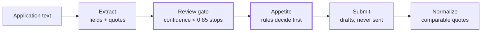

<div align="center">

# UnionSpecialtyEngineer

**An AI-native specialty insurance brokerage — the model reads, the harness decides.**

Every failure mode is measured, not narrated.

[](https://github.com/1Yuriy1/UnionSpecialtyEngineer/actions/workflows/ci.yml)


</div>

## The pipeline, gate by gate



The model never decides. Every field cites a verbatim source quote with a confidence score; anything ungrounded floors to zero; anything below the gate lands in a human review queue. Appetite is hard-coded rules — the model only ranks eligible carriers.

## What shipped

| PR | Delivered | What it proves |
|----|-----------|----------------|
| [#1](https://github.com/1Yuriy1/UnionSpecialtyEngineer/pull/1) | **Offline CI** | Ruff, pytest, and the 12-check appetite eval on Python 3.12 + 3.13 — secret-free, SHA-pinned, under a minute |
| [#2](https://github.com/1Yuriy1/UnionSpecialtyEngineer/pull/2) | **SDK tripwire** | Anthropic 1.x fix, plus an offline test that fails CI if code passes kwargs the installed SDK rejects |
| [#3](https://github.com/1Yuriy1/UnionSpecialtyEngineer/pull/3) | **The trap document** | `app_003`: missing revenue, conflicting dates, a lying loss run, a non-verbatim quote — every landmine pinned by tests |
| [#4](https://github.com/1Yuriy1/UnionSpecialtyEngineer/pull/4) | **The number** | Live claude-sonnet-5 run recorded in [`union-prep/EVALS.md`](union-prep/EVALS.md) — wrong-rate and miss-rate stated separately |
| [#5](https://github.com/1Yuriy1/UnionSpecialtyEngineer/pull/5) | **The written showcase** | The full prose build-out — pitch, arguments, receipts — now at [`docs/OVERVIEW.md`](docs/OVERVIEW.md) |

## The honest miss

> [!WARNING]
> **`11/01/2026`** — November 1, or January 11? The model chose a reading at **0.95 confidence** and sailed past the 0.85 review gate. No human saw it. It is recorded in [`union-prep/EVALS.md`](union-prep/EVALS.md) — published, not buried — because a system whose selling point is measurement has to publish its own misses.

<div align="center">

</div>

## Further plans

Each item converts a documented weakness into a documented strength.

| # | Move | Why |
|---|------|-----|
| 1 | **Deterministic validators** | Ambiguous dates go to review regardless of model confidence — code decides, not the model |
| 2 | **Read-only tool use** | Cross-document reconciliation surfaces conflicts as data; NAICS resolved from a source of truth |
| 3 | **Runtime resilience** | Credential pre-flight, transient-only retries, stage-level resume |
| 4 | **Durable state machine** | Temporal or Postgres behind submission state — a submission that lives for days survives a restart |

## Run it offline

```bash
cd union-prep
python -m venv .venv && source .venv/bin/activate
pip install -e ".[dev]"
python -m pytest                          # 18 offline tests
python evals/run_evals.py --suite appetite  # 12 appetite checks, exit 1 on any failure
```

---

The full written showcase — elevator pitch, design arguments, and build receipts — lives in [`docs/OVERVIEW.md`](docs/OVERVIEW.md).
